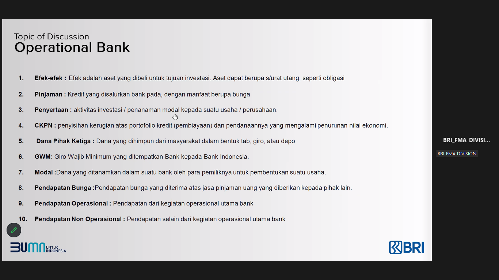
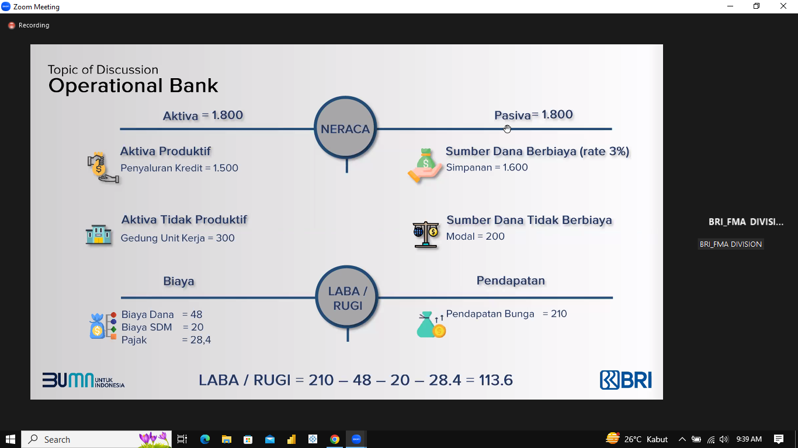
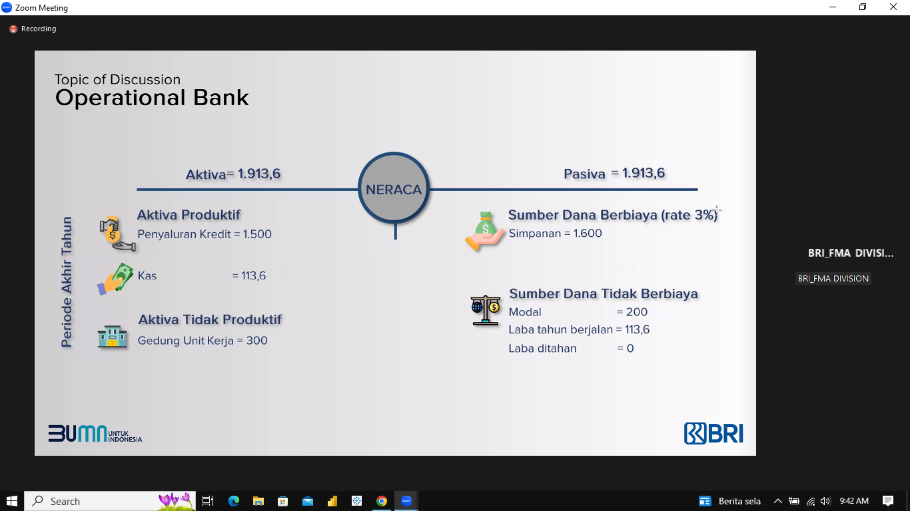
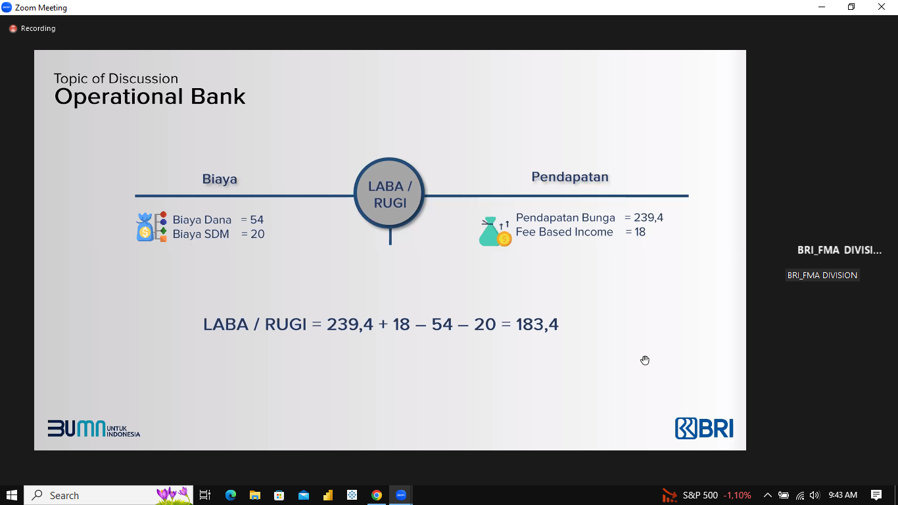
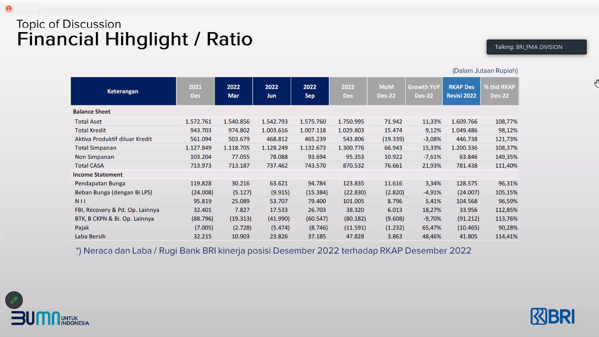
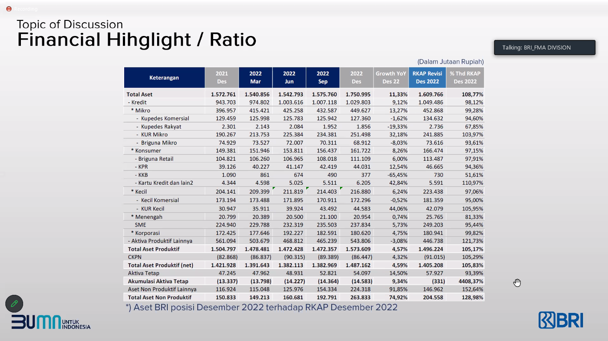

# Financial Highlight
Financial & Management Accounting Division

# Learning Objective
- Understand the Financial Highlights to support BRI's business sustainability
- Siswa mengenal Laporan Keuangan (Neraca dan laba rugi) dan rasio keuangan sebagai alat pengukuran kinerja dan tingkat kesehatan bank

EDM akan bersinggungan dengan divisi PPM untuk membuat *dashboard*

# Introduce Financial Report
> Analisa laporan keuangan disusun untuk kepentingan intern (manajemen), meliputi analisa neraca (posisi keuangan), analisa laba/rugi (pendapatan & biaya), dan analisa antar laporan

Mengumpulkan dana, Menyalurkan dana, Jasa Bank Lainnya (Misalnya penjamin) <--> Financial intermediary <--> Pendapatan Bunga, Pendapatan Non Bunga, Biaya Bunga, Biaya Non Bunga: OHC (overhead cost), Biaya Non Bunga: Others

**Liabilities & Equity** <--> Financial intermediary <--> **Asset** eh yg biaya2 itu ga juga si

Dulu lintah daratnya dari VOC, terus ada inisiatif dari pengurus masjid untuk menggantikan VOC dalam peminjaman modal

Bank bisa menjadi penjamin saat ada nasabah yang membeli rumah seken

Menjadi jasa penjamin bagi nasabahnya saat transaksi antar-negara melalui **LC**

Hati-hati permasalahan cek kosong. Nanti bank sebagai *intermediary* akan saling cek agar transaksi berjalan dengan lancar

**aktiva produktif** adalah asset yg menghasilkan, sedangkan **aktiva tidak produktif** adalah asset yang tidak menghasilkan

# Operational Bank
dan relevansinya terhadap neraca

## Neraca
aktiva: aktiva produktif; aktiva tidak produktif
pasiva: sumber dana berbiaya; sumber dana tidak berbiaya

## Laba/Rugi
biaya: dana, overhead, CKPN
pendapatan: bunga, operasional, non-operasional

bedanya ppap dan ckpn, dua2nya teh pencadangan

kalo ppap, kalo perusahaan telat membayar kredit, maka biaya ckpn nya muncul

kalo biaya ckpn, sebelum telat membayar maka sudah timbul biaya ckpn

efek adalah aset  yang dibeli untuk tujuan investasi. Aset dapat berupa surat utang, seperti obligasi

penyertaan adalah aktivitas investasi / penanaman modal kepada suatu usaha/perusahaan

CKPN adalah penyisihan kerugian atas portofolio kredit (pembiayaan) dan pendanaannya yang mengalami penurunan nilai ekonomi

dana pihak ketiga adalah dana yang dihimpun dari masyarakat dalam bentuk tabungan, giro, atau depo

GWM adalah giro wajib minimum yang ditempatkan bank kepada BI

nama lain dari bank mandiri adalah bank catur (gabungan dari 4 bank)

pencadangan liabilitas penting untuk dilakukan untuk menghadapi crisis

## Menghimpun Dana Sebesar 1600

## Kasus aktivitas bisnis atau keputusan keuangan

# Financial Highlight / Ratio
Analisa rasio keuangan dan laporan keuangan BRI dalam memahami kinerja BRI

